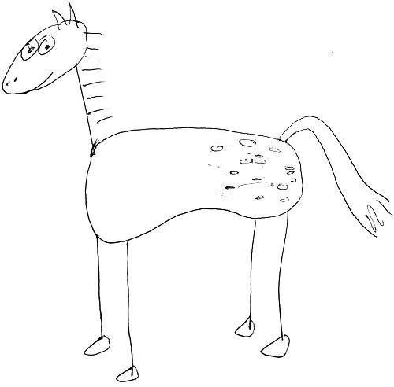

# PROJECT: appaloosa

Finding every flare in every *Kepler* light curve.

## UPDATE:
`appaloosa` is being depricated for now, and we do not reccomend using it for searching for flares. Instead, look to the new project: [AltaiPony](https://github.com/ekaterinailin/AltaiPony)

## About
If you use this code, or the data table of flare stars, please cite the paper [Davenport (2016, ApJ)](https://arxiv.org/abs/1607.03494). 
This work is supported by a NSF Astronomy and Astrophysics Postdoctoral Fellowship under award AST-1501418.

    Q: Why "appaloosa"?
    A: I ran out of better ideas for names
    

## How to appaloosa:
1. Download and have all *Kepler* data ready on cluster
2. Run `condor.py` to prep Condor scheduling scripts
3. Run Condor scripts on cluster
4. Bundle outputs (`aprun` directory) in to .tar.gz file, move to workstation, unpackage
5. Generate a list of .fake output files, run `postprocess.py`
6. gzip the output table
7. Do analysis and create plots for paper by running `analysis.py`, specifically `paper1_plots()`
